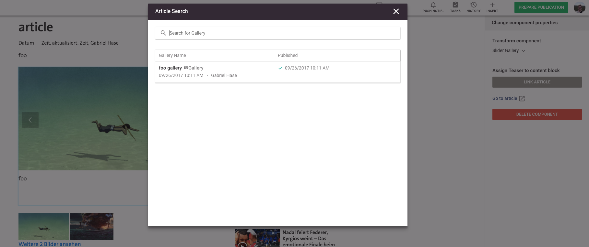
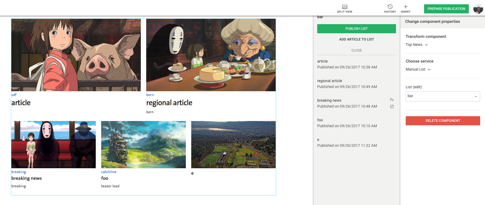

## Core doc-includes

The Livingdocs core predefines 2 editor user interfaces for the `doc-include` services: `embed-teaser` and `list`.
The `embed-teaser` is an article embed. The user can click the component containing the `embed-teaser` include and the sidebar shows a user interface that lets the user select an article to be embedded as a teaser.
The `list` represents a list of articles, commonly seen on startpages of newspapers. It assumes a manually sorted list that can be created with the Livingdocs list interface (see main navigation inside the Livingdocs editor). The sidebar renders a user interface where a user can select a list or re-order the articles in that list.

Both of those core doc-includes require you to implement a custom server-side rendering plugin if you want the preview and rendering insided published documents.

### embed-teaser



The image above shows how a teaser to an image gallery (article type) is linked in an article. The image gallery is selected in the document. The sidebar renders a button "Link Article". If pressed this button opens up a search modal that allows the user to search for gallery articles and select one to be linked.
The search is exactly the same as in the documents dashboard (first screen after Login). You can configure 2 things in this search:
- The `defaultQueries`. Those are hidden filters that are passed to every search query in the search modal.
- The `displayFilters`. This is a list of filters that should be shown to the user to filter the search results. In the example we passed an empty array to the `displayFilters` thus no filters are visible.

#### design definition

Lets see an example component in a Livingdocs design.

```
<script type="ld-conf">
{
  "name": "gallery-embed",
  "label": "Gallery embed",
  "directives": {
    "gallery-embed": {
      "service": "embed-teaser",
      "defaultParams": {
        "layout": "gallery"
      },
      "config": {
        "search": {
          "defaultQueries": [
            {"type": "documentType", "value": "article"},
            {"type": "metadata", "key": "layout", "value": "gallery"}
          ],
          "displayFilters": ["documentState"]
        }
      }
    }
  }
}
</script>

<div doc-include="gallery-embed">
</div>
```

First note that the component makes use of the `embed-teaser` service for the `doc-include` directive `gallery-embed`. It instances the service. We pass a `defaultParams` layout to it that the server-side rendering will be able to make use of.
The most important thing is the configuration in `config.search`. The configuration is equivalent to the one of the dashboard search. Please see [here](../editor-configuration/search-filters.md#predefined-core-properties) for all available options. The configuration in the example above allows the user to select available filters for `documentState` (e.g. published, etc.) and adds the hidden queries to only show articles (no pages) and of the articles only the subset of image galleries. This seems to be a sane default for an image gallery search modal.

#### server-side registration

In order for the user interface to be applied you need to register the `doc-include` on the server.

```
module.exports = function (feature, server, done) {
  const includesApi = server.features.api('li-includes')
  includesApi.registerService({
    name: 'embed-teaser',
    uiComponents: [{
      type: 'angular-modal',
      sidebarLabel: 'Assign Teaser to content block',
      sidebarButton: 'Link Article',
      modalTitle: 'Article Search',
      modalContentComponent: 'liEmbedTeaserIncludeModal'
    }, {
      type: 'angular-component',
      sidebarLabel: ' ',
      sidebarContentComponent: 'liEmbedTeaserLink'
    }],
    rendering: {
      type: 'function',
      function: function (params, options, callback) {
        // TODO render your HTML template given the parameters
        return '<h1>TODO rendering</h1>'
      }
    }
  })
})
```

The above code snippet assumes you are inside a custom feature. See [here](../../walkthroughs/add_customizations.html#server) for how to register a custom feature.
The `name` of the `doc-include` to register must match the service name you used in the design and in the Livingdocs editor. In the case of the article embed, the `name` must be `embed-teaser`.
The first key we have, `uiComponents`, defines a list of ui components that are rendered in the sidebar of the editor for the given `doc-include`. We will come back to all the available options when describing how to do custom editor user interfaces. For now just note that we register 2 angular components: `liEmbedTeaserIncludeModal` and `liEmbedTeaserLink`. Those are predefined in the core and the names must exactly match. (note: if you don't want a link to the embedded article in the sidebar, just leave the `liEmbedTeaserLink` entry away)
The second key `rendering` defines how your doc-include should be rendered. We will come back to the remote options later. For now take note of the function method that allows you to define a function that returns the rendering of the doc-include as an HTML string.

#### Enable for publishing

The registered rendering method will render the `doc-include` preview in the editor for you. You can also use it to render the `doc-include` upon publishing, i.e. delivering the rendered `doc-include` over the public API. You can perform this setting per channel and rendition. Below is an example channel configuration for the web channel.

```
renditions:
  'web':
    livingdocMiddleware: []
    output:
      'html':
        outputRenderer: new CheerioHtml
          middleware: []
        resolveIncludes: ['embed-teaser']
  'app':
    livingdocMiddleware: []
    output:
      'json':
        outputRenderer: appRenderer
```

There are 2 renditions here, web and app. For the web, the `embed-teaser` include is resolved (`resolveIncludes`) thus in my published HTML documents I will see the rendered `doc-include` according to the rendering function I wrote. For the app, no includes are resolved, thus I will only get placeholders containing the parameters without any rendering happening.

### list



The image above shows how a manually sorted list of article teasers is created in Livingdocs. Upon selecting the component, the user can select a list in the sidebar ("bar" in the example). If the user presses "edit" in the sidebar, the user gets a second sidebar (to the left) where she can change the order of articles and add/remove articles. When she presses "Publish List" the preview is updated.

#### design definition

```
<script type="ld-conf">
{
  "name": "top-news",
  "label": "Top News",
  "directives": {
    "top-news": {
      "service": "list",
      "defaultParams": {
        "layout": "topNews"
      },
      "config": {
        "minCount": 5,
        "maxCount": 5
      }
    }
  }
}
</script>

<div doc-include="top-news">
  <div class="embed top-news">
    <div class="placeholder"></div>
  </div>
</div>
```

This time the component makes use of the `list` service for the `doc-include` directive `top-news`. It instances the list service. We again pass a `defaultParams` layout to it that the server-side rendering will be able to make use of.
The configuration lets you define a `minCount` and `maxCount` for the list. The user gets a number input in the editor sidebar where he can select a number between `minCount` and `maxCount`. In the example `minCount` and `maxCount` are equal. If this is the case, no number input is rendered in the sidebar (since the user couldn't set anything anyway).

#### server-side registration

```
module.exports = function (feature, server, done) {
  const includesApi = server.features.api('li-includes')
  includesApi.registerService({
    name: 'list',
    uiComponents: [
      {
        type: 'angular-component',
        sidebarLabel: 'List',
        sidebarContentComponent: 'liManualList'
      }
    ],
    rendering: {
      type: 'function',
      function: function (params, options, callback) {
        // TODO render your HTML template given the parameters
        return '<h1>TODO render list</h1>'
      }
    }
  })
}
```

The above code snippet again assumes you are inside a custom feature. See [here](../../walkthroughs/add_customizations.html#server) for how to register a custom feature.
The `name` of the `doc-include` to register must match the service name you used in the design and in the Livingdocs editor. In the case of the manual list, the `name` must be `list`.
The first key we have `uiComponents` defines a list of ui components that are rendered in the sidebar of the editor for the given `doc-include`. For the list example we register the predefined component `liManualList`. The name must much exactly.
The second key `rendering` defines how your doc-include should be rendered. The options and method are equivalent to the `embed-teaser` case.

As with the `embed-teaser` you have to enable the `list` for publishing if you want this. See [the above section](./embed_and_list.md#enable-for-publishing) on how this is done (in the `list` case you need to register `list`).
