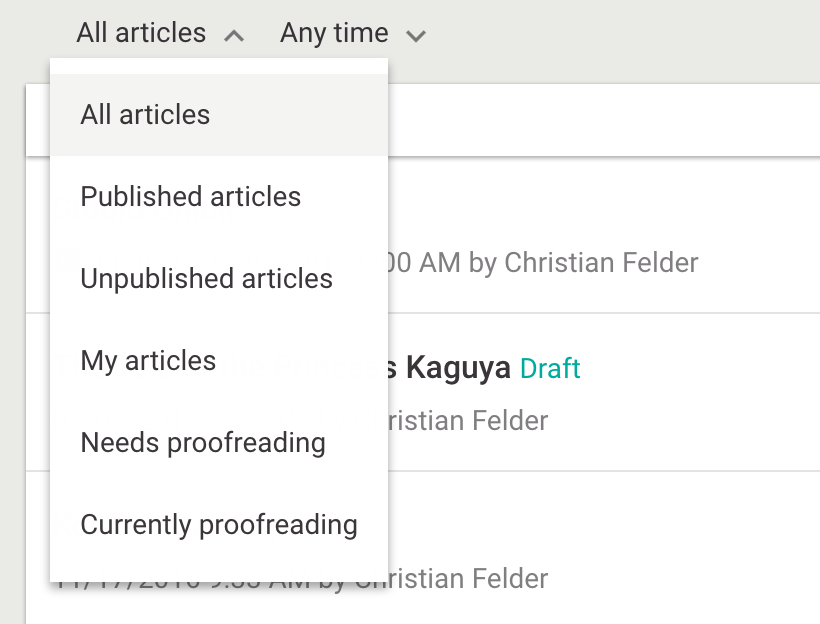

# Search Filters

The editor core API exposes functions to customize the search filters on the dashboard.




## Available config options

- `articleList`

  This configures the dashboard that users see after logging in.

- `inlineArticleList`

  This configures inline article search like the one used in the List screen.

- `pageList`

  This configures the pages screen.

- `documentListList`

  This configures the List screen.

Properties:

- displayFilters

  The filters that are shown to the user.

- defaultQueries

  This setting determines the default filter. This filter is discarded as
  soon as a user manually selects a filter and reapplied when all manually
  chosen filters are deselected.


Example:
```js
filters: {
  articleList: {
    displayFilters: ['channels', 'contentType', 'timeRange', 'sortBy'],
    defaultQueries: [{type: 'documentType', value: 'article'}]
  },
  inlineArticleList: {
    displayFilters: [],
    defaultQueries: [
      {type: 'documentType', value: 'article'},
      {type: 'sortBy', value: '-updated_at'}
      // because `sortBy` is used here, it cannot be used as `displayFilters`
    ]
  },
  pageList: {
    displayFilters: [],
    defaultQueries: [
      {type: 'documentType', value: 'page'},
      {type: 'sortBy', value: '-updated_at'}
    ]
  },
  documentListList: {
    displayFilters: ['timeRange'],
    defaultQueries: [
      {type: 'documentType', value: 'article'},
      {type: 'documentState', value: 'published'},
      {type: 'sortBy', value: '-updated_at'}
    ]
  }
}
```

## Predefined core properties

The core allows you to use the following values for `displayFilters`:
- `channels` give the user a dropdown to filter by a specific channel
- `documentState`, unpublished, published, not yet published, my articles, needs proofreading, currently proofreading
- `timeRange`, filter the search results in time ranges such as last 24 hours
- `sortBy`: `relevance` (default), `creation_date`, `updated_at`, `alphabetical`  
  **ATTENTION:** if you use the `sortBy` in the displayFilters you can not at the same time configure a `sortBy` in the `defaultQueries`, only one is allowed.
- `language`: uses the channel configuration for [available languages](../server-configuration/channel-config.md) to offer a select box to filter for languages (requires multi-language feature to be enabled)

The next section shows you how you can add your own custom filters to the ones defined in the core.

The configuration also allows you to set `defaultQueries`. Those are hidden search queries that are appended to each search query of the user. In the `type` you can use the same values as described in the `displayFilters` (including your own custom filters). The `value` describes the (fixed) value you want to set for this hidden query. Example:

```
defaultQueries: [
  {type: 'documentType', value: 'article'}
]
```

This would reduce the search to only articles (no pages). The user has no way to change this.

In addition to the values in the `displayFilters` you can also use a metadata query and a task query in the `defaultQueries`. The metadata query looks as follows:

```
defaultQueries: [
  {type: 'metadata', key: 'foo', value: 'bar'}
]
```

This would filter for only documents that have the value bar in the metadata field foo. You have to make sure that foo is a correctly indexed metadata field.

The tasks query looks as follows:

```
defaultQueries: [
  {type: 'task', taskName: 'proofreading', taskValue: 'done'}
]
```

This would filter for only documents that have had a successful proofreading. The core only exposes the 'proofreading' taks but you can define your own custom tasks. The values are 'todo', 'doing', 'done' for the 3 states that a task can have.

## Registering Custom Filters

#### Example: Register list

`searchFilters.registerList` registers a filter based on a config object to create an Angular directive for the search UI.
Display is controlled with the `filters` key in the configuration.

There are two flavors to this function

```js
liEditor.searchFilters.registerList('creation-date', ['session', (session) => {
  const channels = _map(session.project.channels, (channel) => ({
    id: channel.id,
    label: channel.label,
    // type and value are used in the query builder
    type: 'channelId',
    value: channel.id
  }))

  return {
    title: 'Filter by channels',
    options: channels
  }
}])

liEditor.searchFilters.registerList('creationDate', {
  title: 'Filter by creation date',
  options: [{
    id: '2015',
    label: 'Created in 2015',
    type: 'dateRange',
    key: 'created_at',
    from: new Date('2015-01-01'),
    to: new Date('2016-01-01')
  }, {
    id: '2016',
    label: 'Created in 2016',
    type: 'dateRange',
    key: 'created_at',
    from: new Date('2016-01-01'),
    to: new Date('2017-01-01')
  }]
})
```

#### Example: Register angular directive

`searchFilters.register` registers an Angular directive as filter for the search UI.
Display is controlled with the `filters` key in the configuration.

```js
liEditor.searchFilters.register('project', ['session', (session) => ({
  scope: {value: '='},
  template: `
    <div
      ng-class="{'filter-active': isActive}"
      ng-click="toggleProjectFilter()">
        Show print documents
    </div>
  `,
  link: (scope) => {
    channel = _find(session.project.channels, {name: 'print'})
    scope.isActive = scope.value.get().value
    scope.toggleProjectFilter: () => {
      scope.isActive = !scope.isActive
      if (scope.isActive) {
        scope.value.set({type: 'channelId', value: !scope.isActive})
      } else {
        scope.value.set()
      }
    }
  }
})])
```
