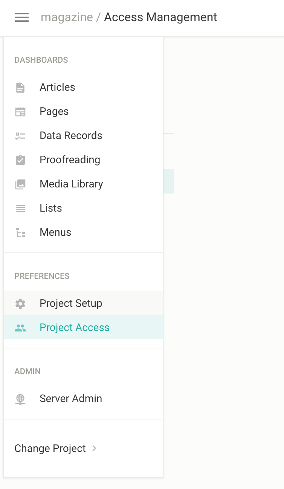
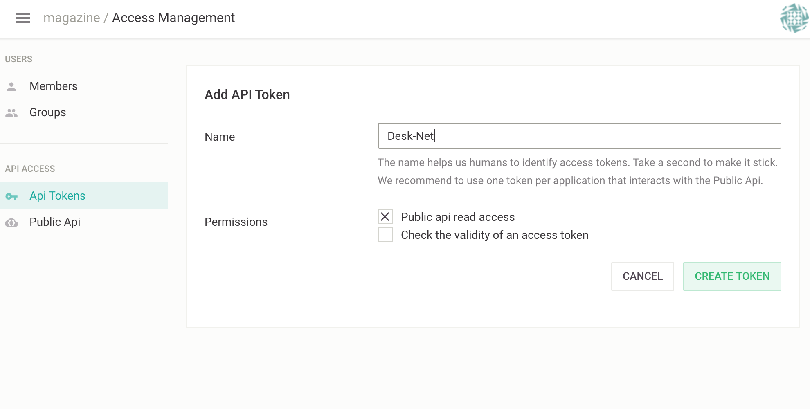
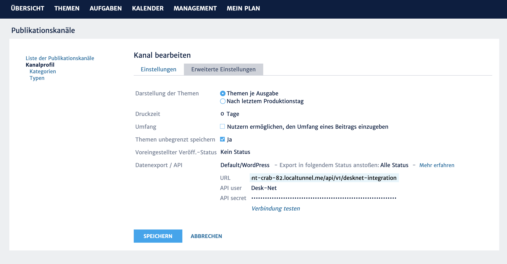

# Desk-Net Integration

[Desk-Net](https://desk-net.com) is a planning tool for publication processes. This feature, if set up properly, lets you easily connect your Desk-Net world to your Livingdocs universe. Here's a few things you can do:

* Create Livingdocs documents directly from Desk-Net.
* Sync publication status between the two domains.
* Exchange and sync any data that is relevant to your workflow.

We have a video on Vimeo explaining the necessary steps to configure Desk-Net through our UI: [https://vimeo.com/368750546](https://vimeo.com/368750546) The rest of this guide will detail the underlying data structures in case you don't want to use the UI.

## Setup

### Prerequisites

* You should have a Desk-Net account and a set of valid API credentials to authorize Livingdocs to access the Desk-Net HTTP API.
* You should be somewhat familiar with the Desk-Net data entities \(Stories, Publications, Platforms and so on\). A technical overview can be found [here](https://api.desk-net.com)
* You should know about the different Livingdocs configuration levels/methods, namely the [channel config](channel-config.md) and the [content type config](content-type-config.md)\)
* You should be familiar with how to [set up custom metadata fields](metadata.md) for your content types.
* For local development, we strongly suggest you use:
  * some kind of http tunnel solution like [ngrok](https://ngrok.com). This is useful, when you want to redirect messages from Desk-Net to your local server.
  * a HTTP API client like [Postman](https://www.getpostman.com/). Very handy to explore the Desk-Net API. Certain configuration settings also need you to provide Desk-Net entity ID's, which are not easily \(or not at all\) accessible via the Desk-Net UI.

### Basic configuration

#### 1. Create a public API token for the project you want to connect with Desk-Net

* In the project menu, select "Project Access".



* Then select "Api Tokens", enter a descriptive name and click "Create token".

.

* In the list of tokens, select "Show" for your newly created token, copy the token and temp-store it somewhere, we're going to use it in a minute.

#### 2. Register the token with Desk-Net

* Log into your Desk-Net account
* Go to "Publication Platforms"
* Click "Edit" for the platform you want to connect with Livingdocs. Select the tab "Advanced Settings".
* Fill in the form "Data / export API". Replace the domain part in the URL with your server domain. Under "API secret", enter the Livingdocs Public API token we created in the last step.



#### 3. Enable the Desk-Net feature

In your main server config, enable the `desknet` feature by simply adding the following:

```javascript
{
  // ...
  desknet: {
    enabled: true
  }
}
```

#### 4. Connect a Livingdocs project to Desk-Net

Add the following to the channel config of the project you want to connect with Desk-Net:

```javascript
{
  // ...
  desknet: {
    credentials: {

      // Desk-Net client ID
      clientId: '******',

      // Desk-Net client secret
      clientSecret: '********'
    },

    // This is the ID of the Desk-Net platform you're connecting with. The easiest way to get
    // this ID is to use an HTTP client like Postman and request the platforms of your Desk-Net account.
    // https://desk-net.com/api/v1_0_0/platforms/
    platformId: 6666666,

    // Desk-Net and Livingdocs have different concepts of what a publication is. In Desk-Net, a story can have
    // one of several freely configurable publication status. Which of those statuses actually means «published»
    // is completely arbitrary. In Livingdocs however, a document is either published or not. So whenever we try to
    // determine / sync the publication status of either of two entities, we have to define a way to translate between those two concepts.
    // Again, the ID's of those statuses are not obvious. https://desk-net.com/api/v1_0_0/publication-status/ should provide you
    // with the ID's needed.  
    publicationStatus: {

      // This is the ID of the status, that in Desk-Net describes a published story.
      publishedStatus: 5,

      // This is the ID of the status, that Livingdocs should send to Desk-Net if a document gets unpublished.
      unpublishedStatus: 1,

      // Otional. If this key is set to true, the publication status is getting synced everytime
      // a change happens in either Livingdocs or Desk-Net. This
      // basically allows you to publish Livingdocs documents directly from Desk-Net. Whether that is desirable or
      // not depends on your workflow.
      sync: false
    },

    // With this setting, we can control what kind of document should get created, when Desk-Net reports a new story.  
    contentTypes: {

      // The default content type.
      standard: 'regular',

      // Optional. These two settings can be used to describe a more sophisticated content type lookup.
      // By providing source path and a mapping object, we actually say this (see actual values):
      // If the Desk-Net element has a value at element.publication.type.name
      //    If this value is 'myType1', take content type 'page'
      //    Else If this value is 'myType2', take content type 'gallery'
      // Else take the standard content type
      source: 'publication.type.name',
      mapping: [{
        source: 'myType1',
        target: 'page'
      }, {
        source: 'myType2',
        target: 'gallery'
      }]
    }
  }
}
```

With all this in place, whenever we create a new story in Desk-Net that is assigned to the platform connected to Livingdocs, we'll have a Livingdocs document created and linked with the Desk-Net element entity that represents the story.

## Mapping Desk-Net values to Livingdocs document metadata

In many cases it is probably desirable to have a little more information about the connected Desk-Net entity on an article, than just merely the fact, that they're somewhat related.

As an example, let's say we want to achieve the following:

* We want to display the planned publication date from Desk-Net in a datetime form field on the «Publish» screen in the Livingdocs Editor.
* We want this field to be shown only for documents of content type `'regular'`.
* We want this field to update, whenever somebody changes the planned publication date in Desk-Net.
* We _don't_ want this field to be editable in Livingdocs.
* The technical label for this field on the metadata should be `desknetPublicationDate` and the actual label should read «Desk-Net – Planned publication»

Let's do this, then!

#### 1. Define a metadata plugin on the content type

Add the plugin to the settings of content type `'regular'`:

```javascript
{
  handle: 'regular'
  // ...
  metadata: [
    // ...
    {
      handle: 'desknetPublicationDate',
      type: 'li-datetime',
      ui: {
        component: 'liMetaDatetimeForm',
        config: {
          readOnly: true,
          label: 'Desk-Net – Planned publication'
        }
      }
    }
    // ...
  ]
}
```

As mentioned before, we won't go further into how to set up metadata at this point, but you can read all about that [here](https://github.com/livingdocsIO/livingdocs/tree/29994840d3de4e9fc999395c30686a388b7da9bb/reference-docs/server-configuration/metadata/README.md).

#### 2. Set up a mapping that defines how to translate from Desk-Net to Livingdocs

Again to the settings of content type `'regular'`, add the following:

```javascript
{
  handle: 'regular'
  // ...
  desknet: {
    // A list of mapping objects. Each mapping object describes one metadata field.
    metadata: [
      {
        // Optional. If set to true, every time we change the publication status in Livingdocs, the update  
        // broadcast to Desk-Net will include the source path associated to the target value. The inverse result of
        // the mapping, so to speak.
        sync: false,

        // The path to the value on the Desk-Net element
        source: 'publication.single.start.date',
        // The path to the Livingdocs metadata property
        target: 'metadata.desknetPublicationDate'
      }
    ]
  }
}
```

And we're all set. From now on, whenever you create a new story on Desk-Net with a scheduled publication date or change the scheduled publication date on an existing story _and_ the story at hand is assigned to a platform connected to Livingdocs, the metadata of the document will have an up-to-date property `desknetPublicationDate` with the date as value.

#### What are the available Desk-Net properties?

When determining mapping results we analyze an enriched version of the result of [GetElement](http://api.desk-net.com/#api-Element-GetElement) on the Desk-Net API.

The following prefetches are already in place:

* `elementStatus` – [GetElementStatus](http://api.desk-net.com/#api-Element_status-GetElementStatus)
* `publications[].status` – [GetPublicationStatus](http://api.desk-net.com/#api-Publication_status-GetPublicationStatus)
* `publications[].category` – [GetCategory](http://api.desk-net.com/#api-Category-GetCategory)
* `publications[].platform` – [GetPlatform](http://api.desk-net.com/#api-Platform-GetPlatform)
* `publications[].type` – [GetType](http://api.desk-net.com/#api-Type-GetType)

Additionally, all elements have

* a property `publication` which always points at the one connected to the platformId set up in the current channel config.
* a property `publications[]` which contains all publications, and at least one which is the same as the one at `publication`.

You can find a full example at [the end of this document](desknet-integration.md#full-example).

#### What are the available Livingdocs properties?

Everything in metadata. Nothing else. So whatever metadata plugins you have set up in your content type config, you can write to and read from them freely, as long as the data types correlate. If they don't, you probably want to use a transform function.

## Advanced mappings: Using transform functions

### Introduction

In cases, where trivial source/target mappings simply don't cut it, you can write and register custom transform functions to handle the data translation between the entities.

There are two kinds of transform functions:

* _Import functions_ handle incoming data from Desk-Net.
* _Export functions_ handle data that should get sent to Desk-Net.

**Transform functions should always be asynchronous**

The import and export procedures are actually quite similar: They translate data from one domain to the other. But in our case, there are two peculiarities, that you should take note off:

* An an import function always gets resolved to a single corresponding metadata field. The return value must comply to the requirements of the related metadata plugin.
* An export function should always return an object of \(possibly nested\) key/value pairs. It should only contain keys accepted by Desk-Net.

This means that your import functions only ever resolve to a single field, while export functions can aggregate and return multiple keys.

### Registering and referencing transforms

Let's do another example:

* We want to display whether the Desk-Net story is also assigned to any platform with some occurrence of the word `'Print'` in its name.
* We want this field to be shown only for documents of content type `'regular'`.
* We want this field to be shown as a checkbox, so we're looking for a boolean value.
* We _don't_ want this field to be editable in Livingdocs.
* The technical label for this field on the metadata should be `hasPrint` and the actual label should read «Desk-Net – Is planned for Print»

First, we have to write and register the transforms. As we have to register transforms before the server actually starts, but only after the application is properly up and running, we use a [hook](hooks.md) for that:

```javascript
liServer.registerInitializedHook(async () => {

  const {
    registerTransform
  } = liServer.features.api('li-integrations-desknet-api')


  // Takes two arguments:
  // - A string identifier, we call that the handle.
  // - Your transform function.
  registerTransform(
    'readHasPrint',
    async (desknetApi, element, document) => {
      return element.publications
        .some(p =>
          p.platform &&
          typeof p.platform.name === 'string' &&
          p.platform.name.indexOf('Print') >= 0)
    }
  )
}
```

Now, we have to a\) add a metadata plugin and b\) a transform mapping to the settings of content type `'regular'`:

```javascript
{
  handle: 'regular'
  // ...
  metadata: [
    // ...
    {
      handle: 'hasPrint',
      type: 'li-boolean',
      ui: {
        config: {
          readOnly: true,
          label: 'Desk-Net – Planned publication'
        }
      }
    }
    // ...
  ],
  desknet: {
    // A list of mapping objects. Each mapping object describes one metadata field.
    metadataTransforms: [
      {
        // Optional. The function name, or handle, under which the transform was registered.
        importFunctionHandle: 'readHasPrint',

        // The function name, or handle, under which the transform was registered.
        exportFunctionHandle: null,

        // Mandatory if importFunctionHandle is provided.
        // The path to the Livingdocs metadata property the import transform will get resolved to.
        // The value at target will also be passed to any registered export function.
        target: 'metadata.hasPrint'
      }
    ]
  }
}
```

### API

#### Import functions

```javascript
async function myImportTransform (desknetApi, element, document): any
```

* `desknetApi` – A [set of helper functions](desknet-integration.md#desknet-api) to make requests to the Desk-Net API.
* `element` – The Desk-Net [element](desknet-integration.md#full-example)
* `document` – Optional. The Livingdocs document. Only provided if it's an update operation.

#### Export functions

```javascript
async function myExportTransform (desknetApi, element, document): Object
```

* `desknetApi` – A [set of helper functions](desknet-integration.md#desknet-api) to make requests to the Desk-Net API.
* `value` – The value of the metadata field at `target` \(see config section above\).
* `element` – The Desk-Net [element](desknet-integration.md#full-example)
* `document` – The Livingdocs document.

#### `registerTransform`

```javascript
function registerTransform (handle, transform): void
```

* `handle` – String, a unique transform name.
* `transform` – A transform function

#### `unregisterTransform`

```javascript
function unregisterTransform (handle): void
```

* `handle` – String, a unique transform name.

#### Desknet API

A set of helper functions to make authorized requests to the Desk-Net API.

Usage in transforms:

```javascript
const myImportTransform = async (desknetApi, element, document) => {
  const elementStatus await desknetApi.getElementStatus(document.metadata.myCustomStatusField)
  // ...
}
```

* `async function getElement (elementId)` – [GetElement](http://api.desk-net.com/#api-Element-GetElement)
* `async function getElementStatus (elementStatusId)` – [GetElementStatus](http://api.desk-net.com/#api-Element_status-GetElementStatus)
* `async function getElementStatus (publicationStatusId)` – [GetPublicationStatus](http://api.desk-net.com/#api-Publication_status-GetPublicationStatus)
* `async function getCategory(categoryId)` – [GetCategory](http://api.desk-net.com/#api-Category-GetCategory)
* `async function getPlatform(platformId)` – [GetPlatform](http://api.desk-net.com/#api-Platform-GetPlatform)
* `async function getType(typeId)` – [GetType](http://api.desk-net.com/#api-Type-GetType)
* `async function getFullElement (elementId)` – This function resolves to a Desk-Net element [with prefetched values](desknet-integration.md#desknet-properties).

**Full Desk-Net element example**

```javascript
{
   "id": 1111111111111,
   "version": 1,
   "elementStatus": {
      "id": 4,
      "name": "No Status"
   },
   "title": "Hallo Test 2",
   "groups": [
      33333333
   ],
   "publications": [
      {
         "id": 222222222,
         "version": 0,
         "status": {
            "id": 4,
            "name": "Top story"
         },
         "category": {
            "id": 5555555,
            "version": 0,
            "name": "TestUnterkategorie",
            "platform": 6666666,
            "category": 7777777,
            "position": 1
         },
         "single": {
            "start": {
               "date": "2019-09-09"
            }
         },
         "platform": {
            "id": 6666666,
            "version": 48,
            "name": "Livingdocs",
            "position": 2,
            "weeklySchedule": {
               "mon": true,
               "tue": true,
               "wed": true,
               "thu": true,
               "fri": true,
               "sat": true,
               "sun": true
            }
         }
      }
   ],
   "url": "https://desk-net.com/mySchedulePage.htm?fragment=de1111111111111",
   "modificationDate": "2019-09-09T08:19:27Z",
   "publication": {
      "id": 222222222,
      "version": 0,
      "status": {
         "id": 4,
         "name": "Top story"
      },
      "category": {
         "id": 5555555,
         "version": 0,
         "name": "TestUnterkategorie",
         "platform": 6666666,
         "category": 7777777,
         "position": 1
      },
      "single": {
         "start": {
            "date": "2019-09-09"
         }
      },
      "platform": {
         "id": 6666666,
         "version": 48,
         "name": "Livingdocs",
         "position": 2,
         "weeklySchedule": {
            "mon": true,
            "tue": true,
            "wed": true,
            "thu": true,
            "fri": true,
            "sat": true,
            "sun": true
         }
      }
   }
}
```

